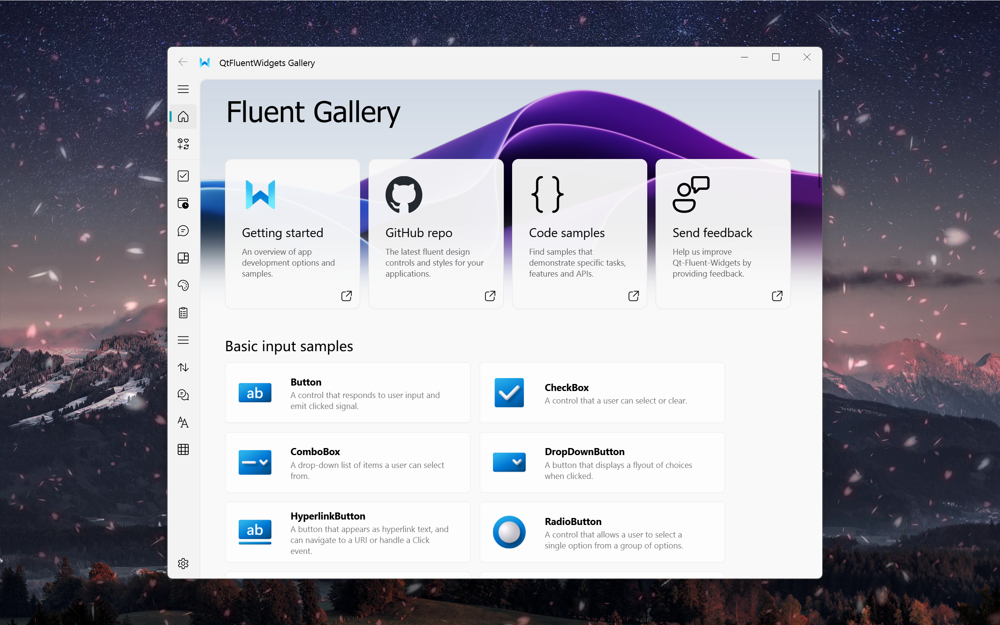

<p align="center">
  
</p>

<h1 align="center">Qt-Fluent-Widgets</h1>

<p align="center">
  A native C++ Fluent Design widget library for Qt 5 and Qt 6, ported from
  <a href="https://github.com/zhiyiYo/PyQt-Fluent-Widgets">PyQt-Fluent-Widgets</a>.
</p>

<div align="center">

[](https://github.com/Fairy-Oracle-Sanctuary/Qt-Fluent-Widgets/tags)
[](LICENSE)

[](https://www.qt.io)


</div>

<p align="center">
  English | <a href="docs/README_zh.md">简体中文</a>
</p>

<p align="center">
  
</p>

## Introduction

Qt-Fluent-Widgets brings Fluent Design controls and window shells to native C++ Qt applications. The project builds as a static library, supports light, dark, and system themes, and includes a Gallery application that demonstrates the available controls.

Highlights:

- Native C++17 implementation with Qt Widgets
- One codebase for Qt 5.15.2+ and Qt 6.x
- Fluent window shells with side, compact, split, and top navigation
- Theme-aware controls, icons, animations, and Fluent materials
- CMake integration through the `qtfluentwidgets` target

## Components

| Category | Representative classes |
| --- | --- |
| Windows | `FluentWindow`, `MSFluentWindow`, `SplitFluentWindow`, `TopFluentWindow` |
| Navigation | `NavigationInterface`, `TopNavigationInterface`, `NavigationBar`, `BreadcrumbBar`, `Pivot`, `SegmentedWidget`, `TabBar` |
| Buttons and input | `PushButton`, `ToolButton`, `ToggleButton`, `SplitPushButton`, `LineEdit`, `ComboBox`, `SpinBox`, `Slider`, `SwitchButton` |
| Cards and settings | `CardWidget`, `HeaderCardWidget`, `GroupHeaderCardWidget`, `SettingCard`, `ExpandSettingCard`, `OptionsSettingCard` |
| Data and media | `ListView`, `TableView`, `TreeView`, `FlipView`, `HorizontalFlipView`, `PipsPager`, `ImageLabel`, `AvatarWidget` |
| Date and time | `TimePicker`, `DatePicker`, `CalendarPicker`, `FastCalendarPicker` |
| Feedback and dialogs | `InfoBar`, `InfoBadge`, `ProgressBar`, `ProgressRing`, `Flyout`, `TeachingTip`, `MessageBox`, `ColorDialog` |
| Layout | `FlowLayout`, `ExpandLayout`, `VBoxLayout` |
| Materials | Acrylic controls and Windows 11 Mica effects |

The table is an overview rather than a complete API list. See [`qtfluentwidgets/qtfluentwidgets.h`](qtfluentwidgets/qtfluentwidgets.h) and the Gallery source for the currently exported controls and usage examples.

## Requirements

- Qt 5.15.2+ or Qt 6.x with the `Widgets` and `Svg` modules
- The Gallery additionally requires Qt `LinguistTools`
- CMake 3.16+
- A C++17 compiler, such as MSVC 2019+, recent GCC, or recent Clang

The compiler ABI must match the Qt package. For example, the official `msvc2019_64` Qt package must be built with a compatible 64-bit MSVC toolchain.

## Build the Gallery

Configure CMake with the installation prefix of the Qt version you want to use:

```bash
cmake -S . -B build -DCMAKE_PREFIX_PATH=/path/to/Qt/6.x/compiler_64
cmake --build build --config Release --parallel
```

`--config Release` is used by multi-configuration generators such as Visual Studio and Xcode. With a single-configuration generator such as Ninja, add `-DCMAKE_BUILD_TYPE=Release` while configuring.

### Windows: Qt 5.15.2 and MSVC 2019

```powershell
cmake -S . -B build-qt515 `
  -G "Visual Studio 16 2019" -A x64 `
  -DCMAKE_PREFIX_PATH="D:/Qt/5.15.2/msvc2019_64"

cmake --build build-qt515 --config Release --parallel
./build-qt515/app/Release/qtfluentwidgets_app.exe
```

Use a separate build directory when switching Qt versions or generators. The repository root builds both the static library and the Gallery. Release builds enable IPO/LTO when supported; pass `-DQFW_ENABLE_IPO=OFF` to disable it.

Typical Gallery executable locations are:

- Visual Studio Release: `build/app/Release/qtfluentwidgets_app.exe`
- Single-configuration Linux/macOS build: `build/app/qtfluentwidgets_app`

The current Gallery starts with `TopFluentWindow` and includes light/dark theme switching plus demonstrations for the control categories above.

## Integrate the Library

Add the library subdirectory directly if your application does not need to build the Gallery:

```cmake
cmake_minimum_required(VERSION 3.16)
project(MyFluentApp LANGUAGES CXX)

set(CMAKE_CXX_STANDARD 17)
set(CMAKE_CXX_STANDARD_REQUIRED ON)

find_package(QT NAMES Qt6 Qt5 REQUIRED COMPONENTS Widgets Svg)
find_package(Qt${QT_VERSION_MAJOR} REQUIRED COMPONENTS Widgets Svg)

add_subdirectory(
    ${CMAKE_CURRENT_SOURCE_DIR}/third_party/Qt-Fluent-Widgets/qtfluentwidgets
    ${CMAKE_CURRENT_BINARY_DIR}/qtfluentwidgets-build
)

add_executable(my_app main.cpp)
target_link_libraries(my_app PRIVATE qtfluentwidgets)
```

Because the library is static, initialize its compiled resource collection once in your executable:

```cpp
#include <QApplication>
#include <qtfluentwidgets.h>

int main(int argc, char* argv[]) {
    QApplication app(argc, argv);
    Q_INIT_RESOURCE(resource);

    qfw::setTheme(qfw::Theme::Auto);

    qfw::TopFluentWindow window;
    window.setWindowTitle("My Fluent App");
    window.resize(1000, 700);
    window.show();

    return app.exec();
}
```

## Windows Deployment

`qtfluentwidgets` is static, but an application built against the standard Qt packages still needs the Qt runtime DLLs and plugins. Deploy them next to the executable with the `windeployqt` from the same Qt installation used for the build:

```powershell
D:/Qt/5.15.2/msvc2019_64/bin/windeployqt.exe `
  --release build-qt515/app/Release/qtfluentwidgets_app.exe
```

## Troubleshooting

- **`spawn ninja ENOENT`**: install Ninja and add it to `PATH`, or select an installed generator such as `Visual Studio 16 2019` in VS Code/CMake Tools.
- **CMake mixes two Qt versions**: use a fresh build directory and make `CMAKE_PREFIX_PATH` point to exactly one Qt installation. For Qt 5, a Qt 6 `qt.toolchain.cmake` must not be reused.
- **A Qt DLL cannot be found**: run the matching `windeployqt`, or temporarily add that Qt installation's `bin` directory to `PATH` while developing.
- **MSVC reports PDB write conflicts**: the project enables `/FS`; avoid building the same build directory from multiple IDE or terminal processes at once.

## Platform Notes

| Platform | Notes |
| --- | --- |
| Windows | Frameless windows and native effects are supported; Mica requires Windows 11. |
| macOS | Frameless windows use native Cocoa integration. |
| Linux | Frameless resize uses Qt's public system-resize API; appearance can vary by window manager and compositor. |

## License

This project is licensed under [GPLv3](LICENSE).

## Acknowledgments

- [zhiyiYo/PyQt-Fluent-Widgets](https://github.com/zhiyiYo/PyQt-Fluent-Widgets), the Python implementation used as the main design and behavior reference
- [QWidget-FancyUI](https://github.com/COLORREF/QWidget-FancyUI), referenced by the Windows frameless-window implementation
- Microsoft Fluent Design System and the Qt framework

This repository is an independent C++ implementation based on the behavior of the open-source Python project. The upstream author also offers a separate commercial C++ product.

## Contributing

Issues and pull requests are welcome. When reporting a problem, include the operating system, Qt version, compiler, generator, build type, and a minimal reproduction when possible.

## Contributors

<a href="https://github.com/Fairy-Oracle-Sanctuary/Qt-Fluent-Widgets/graphs/contributors">
  
</a>
