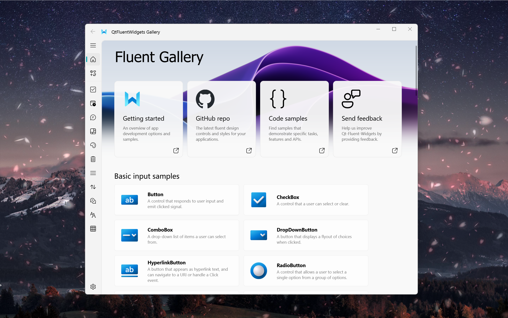

<p align="center">
  
</p>
  <h1 align="center">
  Qt-Fluent-Widgets
</h1>
<p align="center">
  基于 <a href="https://github.com/zhiyiYo/PyQt-Fluent-Widgets">PyQt-Fluent-Widgets</a> 的 Fluent Design 控件库
</p>

<div align="center">

[](https://github.com/Fairy-Oracle-Sanctuary/Qt-Fluent-Widgets)
[](../LICENSE)
[]()
[](https://www.qt.io)

</div>

<p align="center">
<a href="../README.md">English</a> | 简体中文
</p>

<p align="center">
  
</p>

## 📖 简介

Qt-Fluent-Widgets 是对 **zhiyiYo** 开发的流行库 [PyQt-Fluent-Widgets](https://github.com/zhiyiYo/PyQt-Fluent-Widgets) 的 **C++ 原生移植版本**。它为 Qt6 应用程序提供了一套全面的现代 Fluent Design UI 控件。

本项目旨在将精美的 Fluent Design System 带入原生 C++ Qt 应用程序，提供：
- 🎨 **Fluent Design 美学** - Acrylic、Mica 和现代样式
- 🧩 **丰富的控件集合** - 按钮、菜单、对话框、导航等
- ⚡ **高性能** - 原生 C++ 实现
- 🔧 **易于集成** - 静态库直接链接到您的 Qt 项目

## ✨ 特性

| 类别 | 控件 |
|------|------|
| **按钮** | PushButton、ToolButton、RadioButton、CheckBox、ToggleButton、SplitButton |
| **输入** | LineEdit、ComboBox、SpinBox、DoubleSpinBox、TextEdit |
| **对话框** | MessageBox、ColorDialog、Flyout、TeachingTip |
| **导航** | NavigationView、BreadcrumbBar、Pivot、SegmentedWidget、TabBar |
| **状态** | InfoBar、ProgressBar、ProgressRing、StateToolTip、ToolTip、InfoBadge |
| **菜单** | RoundMenu、CommandBar、CheckableMenu |
| **材质** | Acrylic、Mica 效果 (Windows 11) |
| **布局** | 带动画支持的 FlowLayout |

## 📋 系统要求

- **Qt 6.3+**
  - Windows: 推荐 Qt 6.3+
  - macOS: 推荐 Qt 6.9.0
- **CMake 3.16+**
- **C++17 编译器**
  - MSVC 2019+ (Windows)
  - Clang (macOS，通过 Xcode 或命令行工具)

## 🚀 快速开始

### 1. 克隆仓库

```bash
git clone https://github.com/Fairy-Oracle-Sanctuary/Qt-Fluent-Widgets.git
cd Qt-Fluent-Widgets
```

### 2. 构建库

```bash
mkdir build && cd build
cmake ..
cmake --build . --config Release
```

### 3. 集成到您的项目

在您的 `CMakeLists.txt` 中添加：

```cmake
add_subdirectory(Qt-Fluent-Widgets)

target_link_libraries(your_app PRIVATE
    qtfluentwidgets
    Qt6::Widgets
    Qt6::Svg
)
```

### 4. 基本用法

```cpp
#include <QApplication>
#include <qtfluentwidgets.h>

int main(int argc, char *argv[]) {
    QApplication app(argc, argv);
    
    // 设置主题 (Light, Dark, 或 Auto)
    qfw::setTheme(qfw::Theme::Light);
    
    // 创建 Fluent 窗口
    qfw::FluentWindow window;
    window.setWindowTitle("我的 Fluent 应用");
    window.resize(800, 600);
    window.show();
    
    return app.exec();
}
```

## 🎯 示例程序

仓库包含一个展示所有控件的示例程序：

```bash
cd build
./app/qtfluentwidgets_app  # Linux/macOS
qtfluentwidgets_app.exe     # Windows
```

## 🌐 支持平台

| 平台 | 状态 | 说明 |
|------|------|------|
| Windows | ✅ 完全支持 | Acrylic/Mica 效果、无边框窗口 |
| macOS | ✅ 完全支持 | 无边框窗口，原生 Cocoa 集成 |
| Linux | 🚧 占位符 | 无边框窗口尚未实现 |

## 📝 许可证

本项目采用 **GPLv3** 许可证 - 详情请参阅 [LICENSE](../LICENSE) 文件。

## 🙏 致谢

- **zhiyiYo** - 原版 [PyQt-Fluent-Widgets](https://github.com/zhiyiYo/PyQt-Fluent-Widgets) 库的作者
- **zhiyiYo** - [官方文档与演示](https://qfluentwidgets.com/zh/)（Python 版本）
- Microsoft - Fluent Design System 灵感来源
- Qt Framework - 跨平台 UI 开发的基础

> **说明**：本项目是通过参考 PyQt-Fluent-Widgets 的 Python 版本代码逻辑独立编写的 C++ 实现。原作者提供了付费的 C++ 商业版本，本项目是通过学习开源的 Python 版本代码独立开发的。

## 🤝 贡献

欢迎贡献！请随时提交问题和拉取请求。

## 🏆 贡献者

<a href="https://github.com/Fairy-Oracle-Sanctuary/Qt-Fluent-Widgets/graphs/contributors">
  
</a>