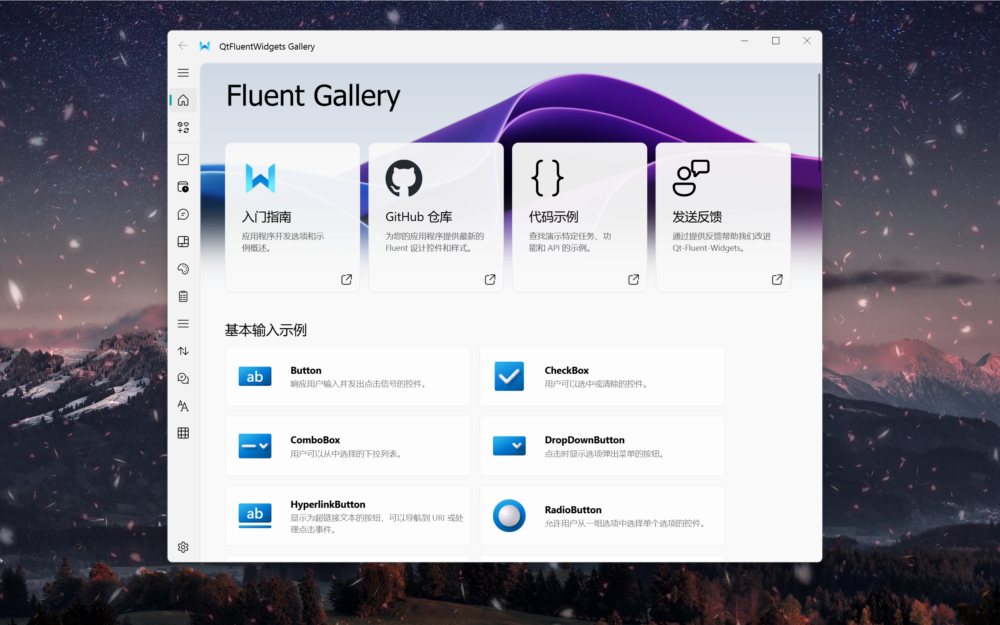

<p align="center">
  
</p>

<h1 align="center">Qt-Fluent-Widgets</h1>

<p align="center">
  面向 Qt 5 与 Qt 6 的原生 C++ Fluent Design 控件库，移植自
  <a href="https://github.com/zhiyiYo/PyQt-Fluent-Widgets">PyQt-Fluent-Widgets</a>。
</p>

<div align="center">

[](https://github.com/Fairy-Oracle-Sanctuary/Qt-Fluent-Widgets/tags)
[](../LICENSE)

[](https://www.qt.io)


</div>

<p align="center">
  <a href="../README.md">English</a> | 简体中文
</p>

<p align="center">
  
</p>

## 简介

Qt-Fluent-Widgets 为原生 C++ Qt 应用提供 Fluent Design 控件和窗口框架。项目以静态库形式构建，支持浅色、深色和跟随系统主题，并附带用于展示现有控件的 Gallery 示例程序。

主要特性：

- 基于 Qt Widgets 的原生 C++17 实现
- 同一套源码兼容 Qt 5.15.2+ 与 Qt 6.x
- 支持侧边、紧凑、分栏和顶部导航的 Fluent 窗口
- 提供主题感知的控件、图标、动画及 Fluent 材质效果
- 通过 CMake 的 `qtfluentwidgets` 目标集成

## 组件概览

| 类别 | 代表性类 |
| --- | --- |
| 窗口 | `FluentWindow`、`MSFluentWindow`、`SplitFluentWindow`、`TopFluentWindow` |
| 导航 | `NavigationInterface`、`TopNavigationInterface`、`NavigationBar`、`BreadcrumbBar`、`Pivot`、`SegmentedWidget`、`TabBar` |
| 按钮与输入 | `PushButton`、`ToolButton`、`ToggleButton`、`SplitPushButton`、`LineEdit`、`ComboBox`、`SpinBox`、`Slider`、`SwitchButton` |
| 卡片与设置 | `CardWidget`、`HeaderCardWidget`、`GroupHeaderCardWidget`、`SettingCard`、`ExpandSettingCard`、`OptionsSettingCard` |
| 数据与媒体 | `ListView`、`TableView`、`TreeView`、`FlipView`、`HorizontalFlipView`、`PipsPager`、`ImageLabel`、`AvatarWidget` |
| 日期与时间 | `TimePicker`、`DatePicker`、`CalendarPicker`、`FastCalendarPicker` |
| 反馈与对话框 | `InfoBar`、`InfoBadge`、`ProgressBar`、`ProgressRing`、`Flyout`、`TeachingTip`、`MessageBox`、`ColorDialog` |
| 布局 | `FlowLayout`、`ExpandLayout`、`VBoxLayout` |
| 材质 | Acrylic 控件及 Windows 11 Mica 效果 |

上表仅用于概览，并非完整 API 列表。当前导出的控件和用法可查看 [`qtfluentwidgets/qtfluentwidgets.h`](../qtfluentwidgets/qtfluentwidgets.h) 以及 Gallery 源码。

## 环境要求

- Qt 5.15.2+ 或 Qt 6.x，并安装 `Widgets`、`Svg` 模块
- Gallery 示例程序还需要 Qt `LinguistTools`
- CMake 3.16+
- 支持 C++17 的编译器，例如 MSVC 2019+、较新的 GCC 或 Clang

编译器 ABI 必须与 Qt 安装包匹配。例如，官方 `msvc2019_64` Qt 包需要使用兼容的 64 位 MSVC 工具链。

## 构建 Gallery

配置时通过 `CMAKE_PREFIX_PATH` 指向要使用的 Qt 安装目录：

```bash
cmake -S . -B build -DCMAKE_PREFIX_PATH=/path/to/Qt/6.x/compiler_64
cmake --build build --config Release --parallel
```

Visual Studio、Xcode 等多配置生成器在构建时使用 `--config Release`。使用 Ninja 等单配置生成器时，应在配置阶段增加 `-DCMAKE_BUILD_TYPE=Release`。

### Windows：Qt 5.15.2 + MSVC 2019

```powershell
cmake -S . -B build-qt515 `
  -G "Visual Studio 16 2019" -A x64 `
  -DCMAKE_PREFIX_PATH="D:/Qt/5.15.2/msvc2019_64"

cmake --build build-qt515 --config Release --parallel
./build-qt515/app/Release/qtfluentwidgets_app.exe
```

切换 Qt 版本或 CMake 生成器时，请使用新的构建目录。仓库根目录会同时构建静态库和 Gallery。Release 构建会在工具链支持时启用 IPO/LTO；如需关闭，可在配置时传入 `-DQFW_ENABLE_IPO=OFF`。

Gallery 可执行文件的常见位置：

- Visual Studio Release：`build/app/Release/qtfluentwidgets_app.exe`
- Linux/macOS 单配置构建：`build/app/qtfluentwidgets_app`

当前 Gallery 默认使用 `TopFluentWindow`，提供浅色/深色主题切换，并展示上表中的各类控件。

## 集成静态库

如果自己的应用不需要构建 Gallery，可直接添加库目录：

```cmake
cmake_minimum_required(VERSION 3.16)
project(MyFluentApp LANGUAGES CXX)

set(CMAKE_CXX_STANDARD 17)
set(CMAKE_CXX_STANDARD_REQUIRED ON)

find_package(QT NAMES Qt6 Qt5 REQUIRED COMPONENTS Widgets Svg)
find_package(Qt${QT_VERSION_MAJOR} REQUIRED COMPONENTS Widgets Svg)

add_subdirectory(
    ${CMAKE_CURRENT_SOURCE_DIR}/third_party/Qt-Fluent-Widgets/qtfluentwidgets
    ${CMAKE_CURRENT_BINARY_DIR}/qtfluentwidgets-build
)

add_executable(my_app main.cpp)
target_link_libraries(my_app PRIVATE qtfluentwidgets)
```

由于该库是静态库，需要在应用程序中初始化一次编译进库内的资源：

```cpp
#include <QApplication>
#include <qtfluentwidgets.h>

int main(int argc, char* argv[]) {
    QApplication app(argc, argv);
    Q_INIT_RESOURCE(resource);

    qfw::setTheme(qfw::Theme::Auto);

    qfw::TopFluentWindow window;
    window.setWindowTitle("我的 Fluent 应用");
    window.resize(1000, 700);
    window.show();

    return app.exec();
}
```

## Windows 部署

`qtfluentwidgets` 本身是静态库，但使用标准 Qt 安装包构建的应用仍需要 Qt 运行库 DLL 和插件。请使用与构建时相同 Qt 安装目录中的 `windeployqt`，将依赖部署到可执行文件旁：

```powershell
D:/Qt/5.15.2/msvc2019_64/bin/windeployqt.exe `
  --release build-qt515/app/Release/qtfluentwidgets_app.exe
```

## 常见问题

- **出现 `spawn ninja ENOENT`**：安装 Ninja 并将其加入 `PATH`，或在 VS Code/CMake Tools 中选择已安装的生成器，例如 `Visual Studio 16 2019`。
- **CMake 混用了两个 Qt 版本**：使用全新的构建目录，并让 `CMAKE_PREFIX_PATH` 只指向一个 Qt 安装目录。使用 Qt 5 时，不要复用 Qt 6 的 `qt.toolchain.cmake`。
- **启动时提示缺少 Qt DLL**：运行对应版本的 `windeployqt`；开发期间也可临时将该 Qt 安装目录下的 `bin` 加入 `PATH`。
- **MSVC 报告 PDB 写入冲突**：项目已启用 `/FS`；同时应避免多个 IDE 或终端进程并行构建同一个构建目录。

## 平台说明

| 平台 | 说明 |
| --- | --- |
| Windows | 支持无边框窗口和原生效果；Mica 需要 Windows 11。 |
| macOS | 无边框窗口使用原生 Cocoa 集成。 |
| Linux | 无边框缩放使用 Qt 的公开系统缩放 API；具体外观可能受窗口管理器和合成器影响。 |

## 许可证

本项目采用 [GPLv3](../LICENSE) 许可证。

## 致谢

- [zhiyiYo/PyQt-Fluent-Widgets](https://github.com/zhiyiYo/PyQt-Fluent-Widgets)：本项目主要的设计与行为参考
- [QWidget-FancyUI](https://github.com/COLORREF/QWidget-FancyUI)：Windows 无边框窗口实现参考
- Microsoft Fluent Design System 与 Qt Framework

本仓库是根据开源 Python 项目的行为独立实现的 C++ 版本。上游作者另有独立的商业 C++ 产品。

## 参与贡献

欢迎提交 Issue 和 Pull Request。报告问题时，建议提供操作系统、Qt 版本、编译器、生成器、构建类型，并尽可能附上最小复现。

## 贡献者

<a href="https://github.com/Fairy-Oracle-Sanctuary/Qt-Fluent-Widgets/graphs/contributors">
  
</a>
